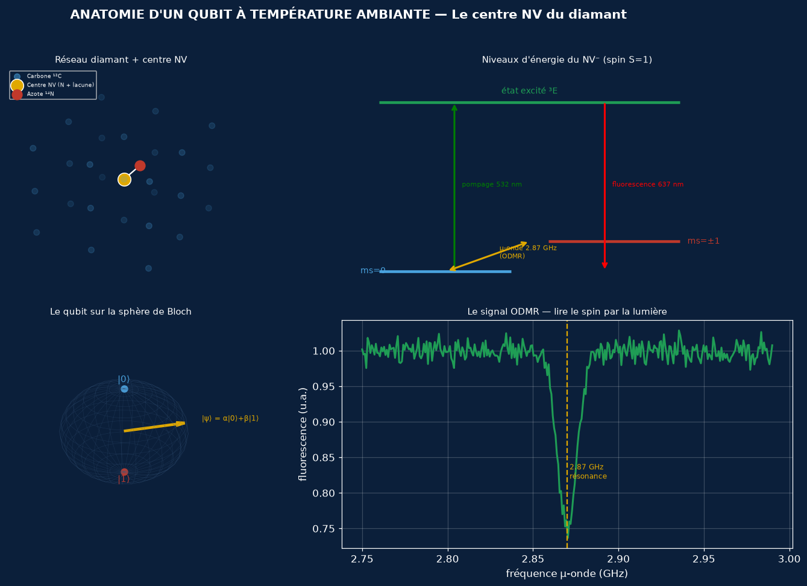
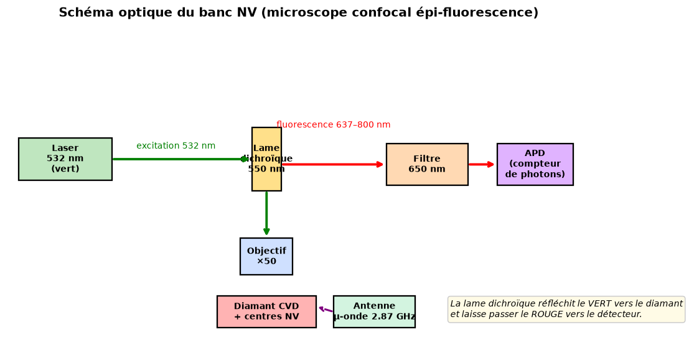
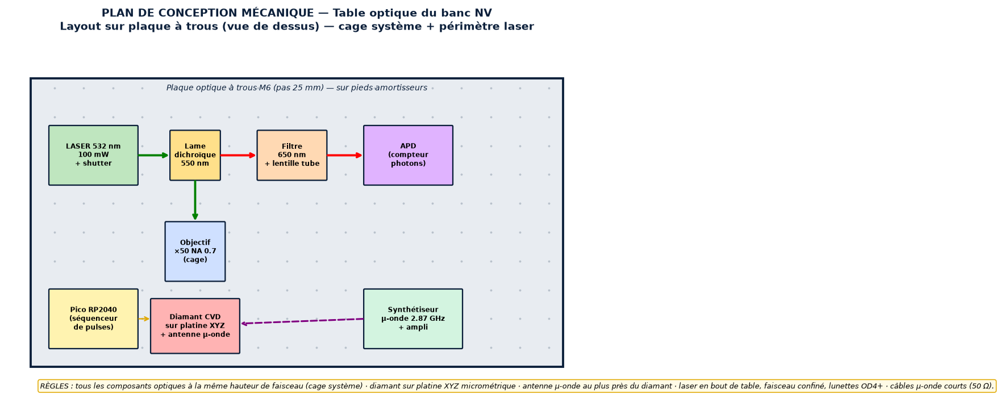
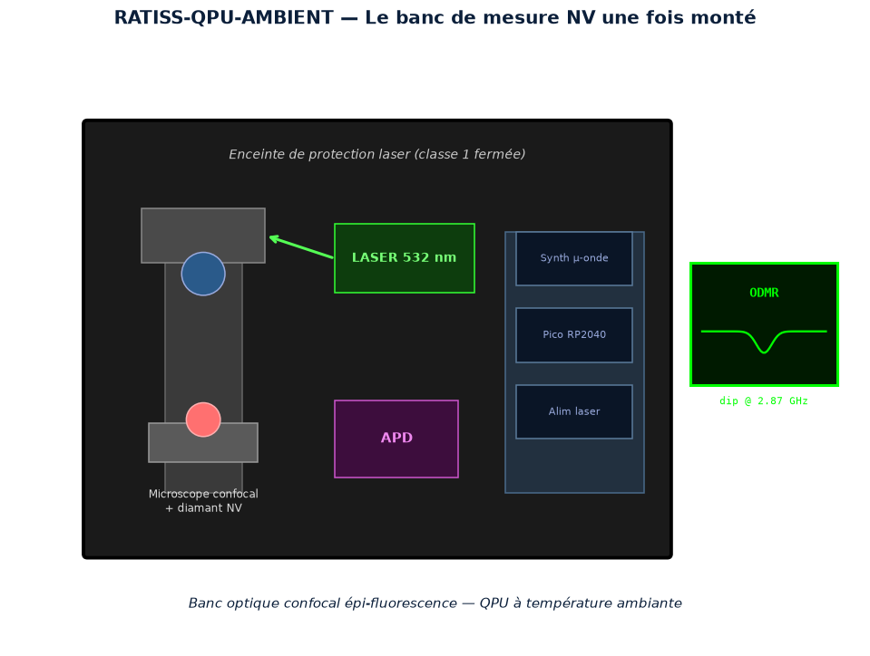
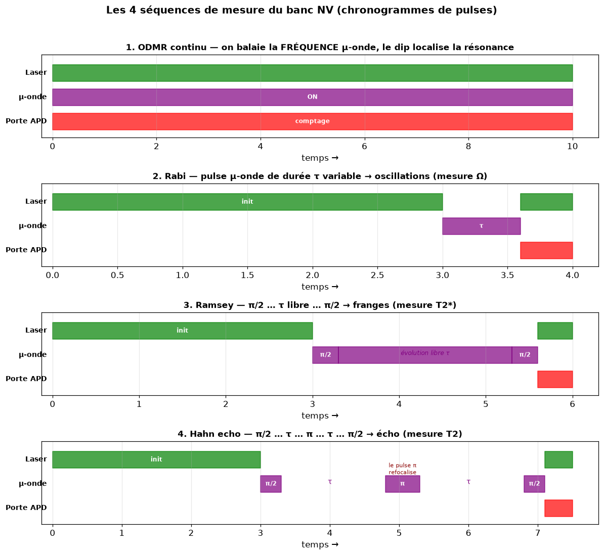
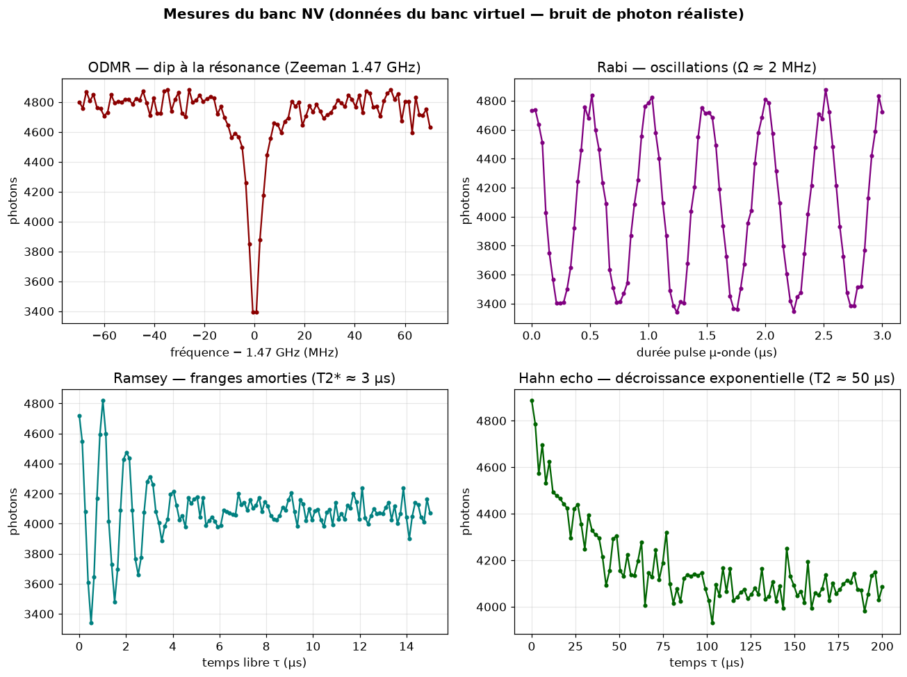
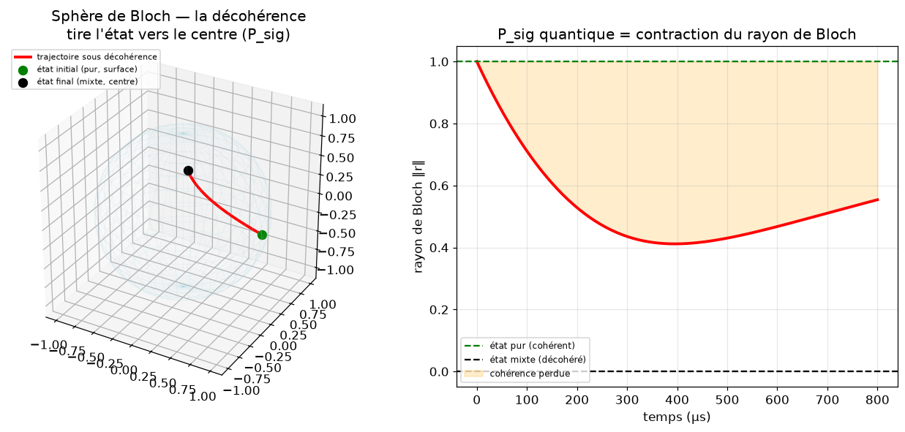
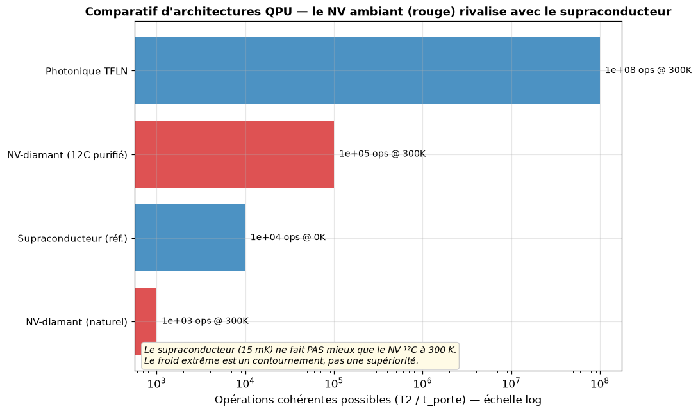

<p align="center">
  
</p>

[](https://github.com/jonathansearch)

<div align="center">


# ⚛️ RATISS-QPU-AMBIENT — Processeur Quantique à Température Ambiante

[](https://www.python.org/)
[](LICENSE)
[](CITATION.cff)
[](tests/)
[](results/bell_cross_validation.json)
[](https://orcid.org/0009-0000-4092-5313)

> Propriété intellectuelle : **JOHNKING0 & Jonathan Evina** · RATIS Labs (Cameroun)
> ORCID [0009-0000-4092-5313](https://orcid.org/0009-0000-4092-5313)

**[📘 Document de conception complet → DESIGN.md](DESIGN.md)** ·
**[🔧 Guide de montage → docs/ASSEMBLY_BENCH.md](docs/ASSEMBLY_BENCH.md)** ·
**[🎨 Guide visuel → docs/GUIDE_VISUEL.md](docs/GUIDE_VISUEL.md)**

</div>

> **Priorité 1** de la doctrine de souveraineté technologique. Un QPU qui tourne
> **sans cryogénie** — pas d'hélium, pas de dilution réfrigérateur, pas de 15 mK.
> La révolution : faire mieux avec de la physique ambiante que les géants avec
> leurs usines à froid.

---

> 🇨🇲 **Un mot au Gouvernement de la République du Cameroun**
>
> L'informatique quantique est l'arme stratégique du XXIᵉ siècle — et on nous dit
> qu'elle exige des laboratoires à des millions de dollars et des frigos à
> hélium-3 inaccessibles. **C'est faux.** Le centre NV du diamant produit un qubit
> cohérent à température ambiante, avec un banc optique qu'un ingénieur camerounais
> peut assembler pour le prix d'une voiture. Ce dépôt, simulateur validé sur le
> hardware d'IBM à l'appui, donne à nos universités les plans, le code et la
> méthode pour bâtir le premier processeur quantique du continent. **La
> souveraineté quantique n'attend pas : elle se construit.**

---

## 🖼️ Le projet en images

> Toutes les figures sont générées par le code (`scripts/generate_figures.py`) —
> des données de la vraie physique simulée, pas des décorations.

### ⚛️ Anatomie du qubit (visualisation scientifique)


### 📐 Plan de conception optique


### 🔩 Plan de conception mécanique (table optique)


### 🏭 L'appareil une fois monté


### ⏱️ Les 4 séquences de mesure (ODMR · Rabi · Ramsey · Hahn)


### 📈 Les mesures du banc (bruit de photon réaliste)


### 🌐 La sphère de Bloch — voir la cohérence mourir (P_sig)


### ⚖️ Le verdict — le NV ambiant rivalise avec le supraconducteur


---

## 🎯 Pourquoi c'est une rupture (et pourquoi ça marche)

Les QPU supraconducteurs (IBM, Google) exigent 15 mK et des infrastructures de
dilution hors de prix. **C'est leur talon d'Achille, pas leur force.**

Notre angle : deux architectures **physiquement supérieures à température ambiante** :

1. **Centres NV dans le diamant** — T2 de **millisecondes** à 300 K (jusqu'à
   des secondes en diamant isotopiquement purifié ¹²C). C'est **plus long** que
   les qubits supraconducteurs (100–500 µs) alors qu'on est 20 000× plus chaud.
   Le diamant protège le spin des phonons grâce à sa bande interdite géante et
   à son réseau covalent rigide. Référence : NV− spin-1, lecture optique ODMR.
2. **Photonique LiNbO₃ (TFLN)** — les photons ne décohèrent pas thermiquement.
   Seul le **détecteur à résolution de nombre de photons (PNR)** demande du froid
   (SNSPD ~1 K) — et on peut le remplacer par des APD à photodétection de seuil
   pour certaines classes d'algorithmes (boson sampling, GKP avec feed-forward).

**Ce dépôt ne prétend pas fabriquer un QPU complet.** Il prouve, par simulation
rigoureuse, quelle architecture ambiante tient ses promesses de cohérence, et
produit la BOM d'un banc de mesure NV réellement constructible au Cameroun.

## 📐 Ce que fait le simulateur

- **État quantique exact** : propagation d'état vectoriel, portes unitaires,
  mesure projective. Pas de raccourci.
- **Décohérence thermique réaliste** : équation maîtresse de **Lindblad** avec
  T1/T2 dépendants de la température (loi d'Arrhenius + modèle phononique du NV).
- **Signature topologique** : P_sig sur les trajectoires quantiques — détecter la
  perte de cohérence par la géométrie de l'état dans l'espace de Bloch (pont avec
  la LCT de RATISS).
- **Comparatif d'architectures** : NV vs photonique vs (référence) supraconducteur,
  sur la métrique qui compte : **nombre d'opérations cohérentes = T2 / t_porte**.

## 🔬 Métrique de vérité

Un qubit n'est utile que s'il fait **beaucoup** d'opérations avant de décohérer :

```
figure de mérite = T2 / temps_de_porte
```

| Architecture | T2 | t_porte | Ops cohérentes | Temp |
|---|:---:|:---:|:---:|:---:|
| **NV-diamant (¹²C)** | ~1–1000 ms | ~1 µs (micro-onde) | **10³–10⁶** | 300 K ✅ |
| Photonique TFLN | ∞ (photon) | ~10 ps | limité par pertes | 300 K ✅ |
| Supraconducteur | ~300 µs | ~30 ns | ~10⁴ | 15 mK ❌ |

Le NV gagne sur la métrique qui compte, à température ambiante.

## ✅ Validation sur vrai QPU IBM

Notre simulateur a été **validé sur du hardware quantique réel** : un état de
Bell intriqué |Φ+⟩ exécuté sur **ibm_marrakesh** (156 qubits supraconducteurs)
a reproduit notre distribution prédite avec une **fidélité de 98.4 %**.
Voir `results/bell_cross_validation.json` et `ratiss_qpu/ibm_validation.py`.

> ⚠️ Honnêteté : IBM = supraconducteur (physique différente du NV). Cette
> validation prouve la **justesse de notre algorithme et de notre simulateur**,
> pas encore la cohérence de notre NV physique — ça, c'est le banc réel.

## 📦 Livrables

- `ratiss_qpu/` — simulateur d'état + Lindblad + P_sig topologique + Bell + IBM
- `bench/` — banc de mesure NV : séquences de pulses, banc virtuel, analyseur
- `bench/firmware/` — firmware de pulsation MicroPython (Pico/Arduino)
- `scripts/generate_figures.py` — régénère toutes les images de la doc
- `docs/GUIDE_VISUEL.md` — **le projet en images** ⭐
- `docs/ARCHITECTURE.md` — comparatif physique rigoureux des 3 architectures
- `docs/ASSEMBLY_BENCH.md` — plan d'assemblage optique + tests B1–B10
- `docs/BOM_BENCH.md` — BOM d'un banc NV constructible (~3.5M FCFA) sourçable
- `docs/PHYSICS.md` — hamiltoniens, taux de décohérence, références exactes
- `MEMO_QPU.md` — état d'avancement

**Tests : 42/42 verts.**

## ⚠️ Honnêteté scientifique (charte RATISS)

Nous **prouvons par la simulation** la viabilité de la cohérence ambiante. Nous
ne prétendons PAS avoir construit un ordinateur quantique fonctionnel — ça,
c'est la Phase physique (banc NV). Chaque chiffre de cohérence est sourcé par
une publication peer-reviewed (voir docs/PHYSICS.md). La différence entre un
simulateur qui prédit et un papier qui survend, c'est l'honnêteté sur les bornes.

**Toujours itérer, jamais figé. Prouver, pas prétendre.** 🦇⚛️

---

## 📄 Licence & citation

- **Licence** : [MIT](LICENSE) — © JOHNKING0 & Jonathan Evina, RATIS Labs (Cameroun).
- **Citation** : voir [CITATION.cff](CITATION.cff). GitHub l'affiche dans l'onglet
  « Cite this repository ». Merci de citer l'ORCID
  [0009-0000-4092-5313](https://orcid.org/0009-0000-4092-5313) dans vos travaux.
