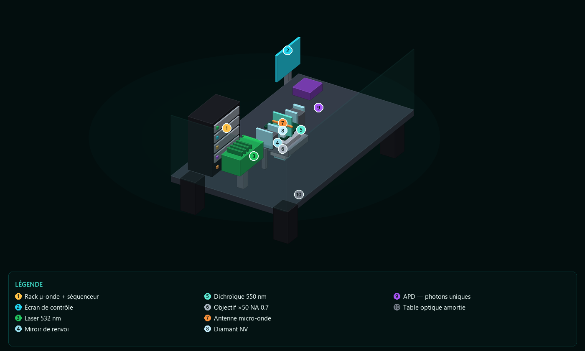
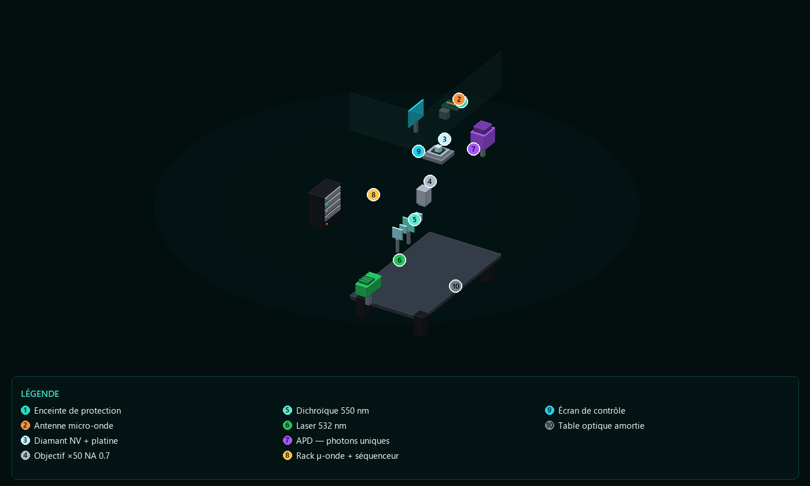
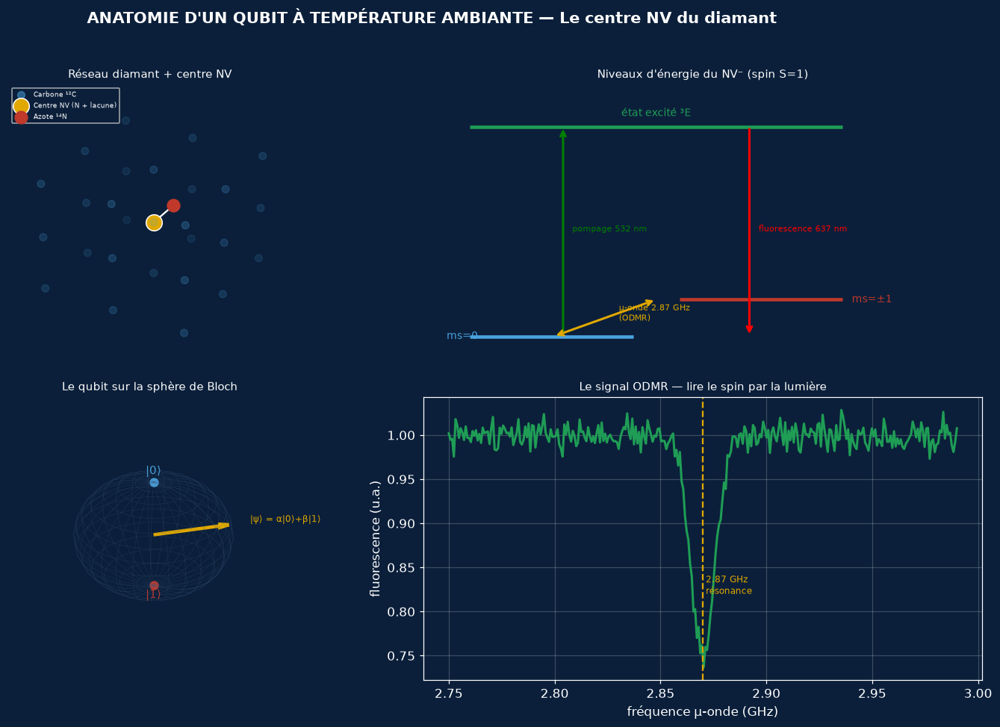
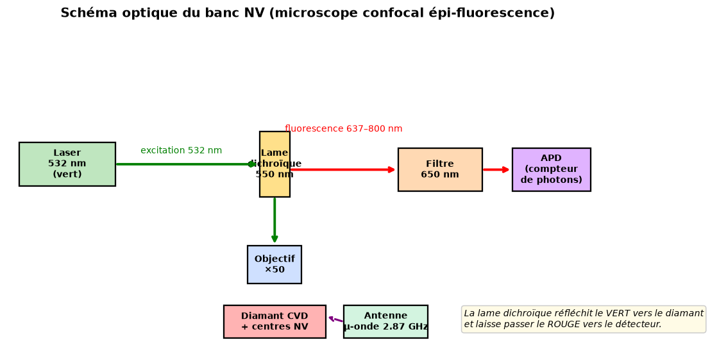
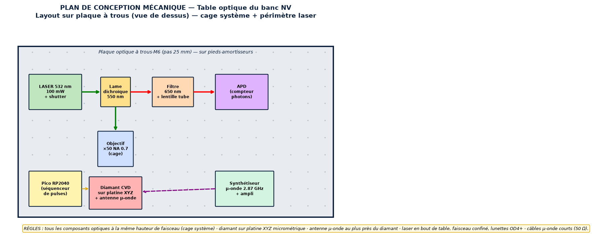
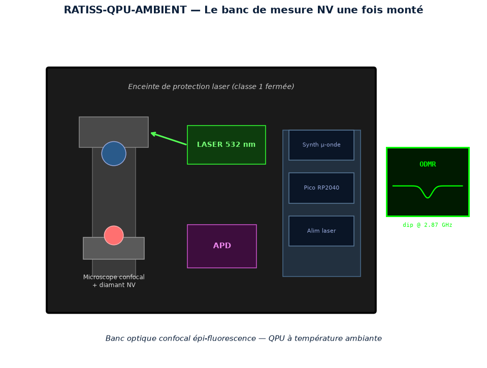
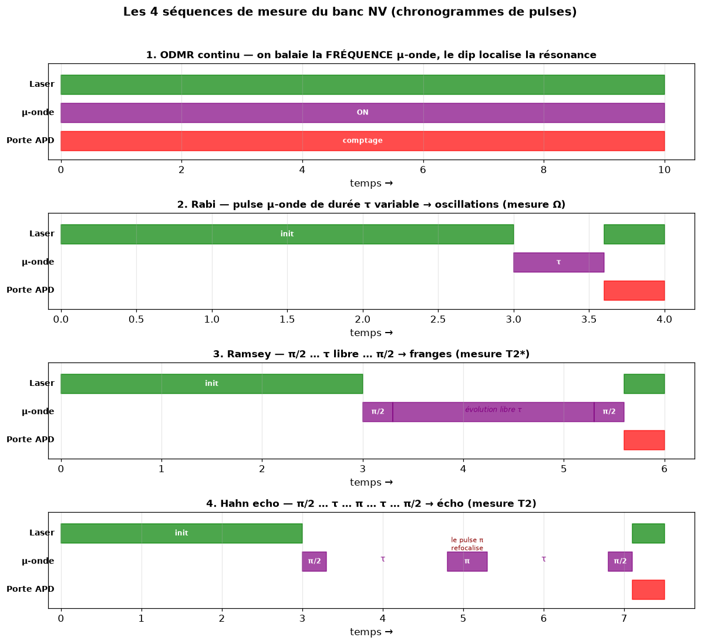
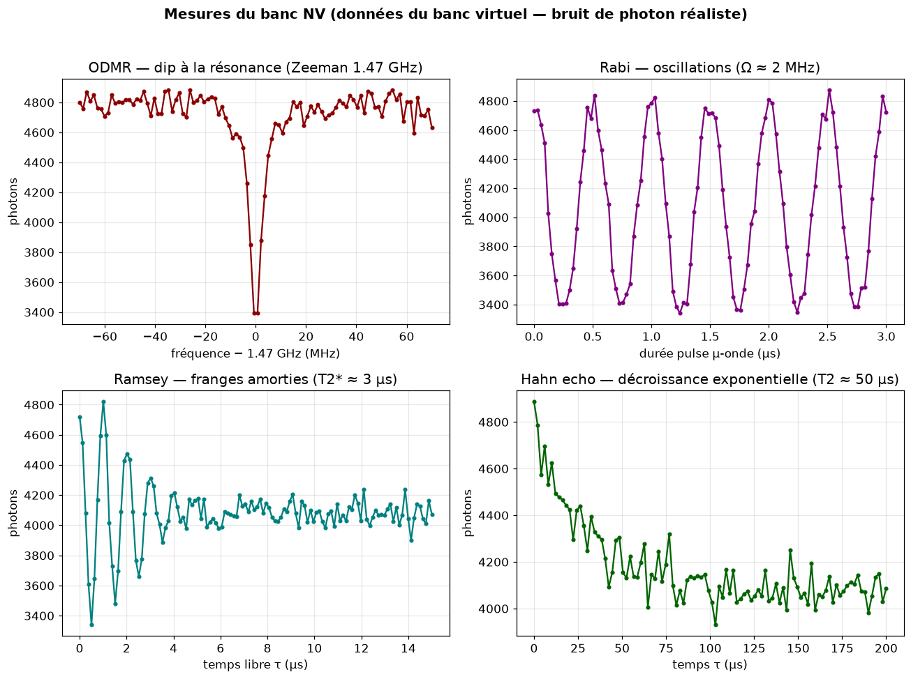
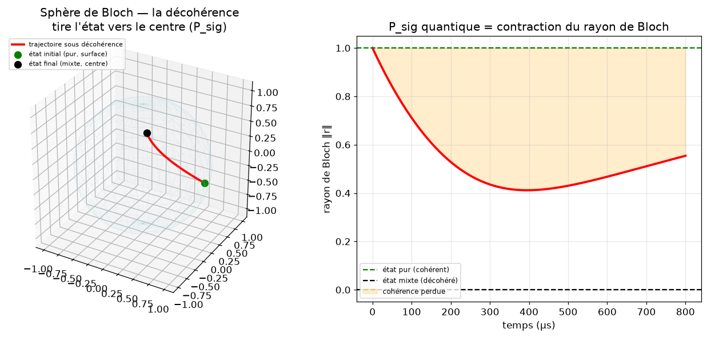
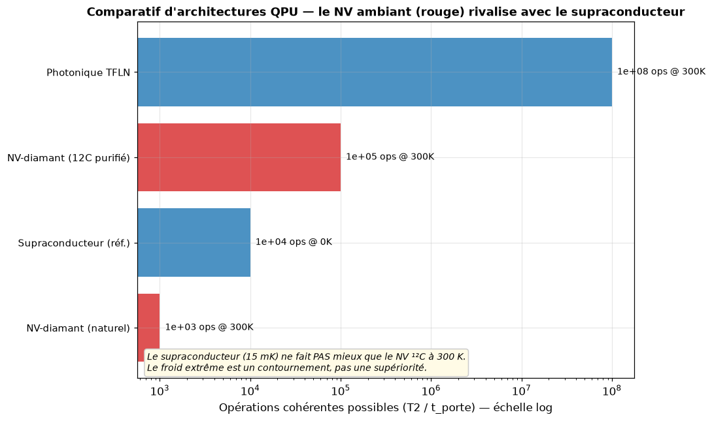

<p align="center">
  
</p>

[](https://github.com/jonathansearch)

<div align="center">


# ⚛️ RATISS-QPU-AMBIENT — Room-Temperature Quantum Processor

[](https://www.python.org/)
[](LICENSE)
[](CITATION.cff)
[](tests/)
[](results/bell_cross_validation.json)
[](https://orcid.org/0009-0000-4092-5313)

> Intellectual property: **JOHNKING0 & Jonathan Evina** · RATIS Labs (Cameroon)
> ORCID [0009-0000-4092-5313](https://orcid.org/0009-0000-4092-5313)

**[📘 Full design document → DESIGN.md](DESIGN.md)** ·
**[🔧 Assembly guide → docs/ASSEMBLY_BENCH.md](docs/ASSEMBLY_BENCH.md)** ·
**[🎨 Visual guide → docs/GUIDE_VISUEL.md](docs/GUIDE_VISUEL.md)**

</div>

> **Priority 1** of the technological sovereignty doctrine. A QPU that runs
> **without cryogenics** — no helium, no dilution refrigerator, no 15 mK.
> The revolution: doing better with ambient physics than the giants with
> their cold factories.

---

> 🇨🇲 **A word to the Government of the Republic of Cameroon**
>
> Quantum computing is the strategic weapon of the 21st century — and we are told
> it requires multi-million-dollar laboratories and inaccessible helium-3
> fridges. **That is false.** The NV center in diamond produces a coherent qubit
> at room temperature, with an optical bench a Cameroonian engineer can assemble
> for the price of a car. This repo — simulator validated on IBM hardware as
> evidence — gives our universities the blueprints, the code, and the method to
> build the continent's first quantum processor. **Quantum sovereignty does not
> wait: it is built.**

---

## 🖼️ The project in images

> All figures are generated by code (`scripts/generate_figures.py`) —
> data from the real simulated physics, not decorations.

## 🖼️ The assembled NV bench — 3D view

<p align="center">
  
</p>

<p align="center">
  <em>Isometric schematic of the bench. 10 labeled elements, from the laser
  source to the single-photon detector.</em>
</p>

**The signal path**, left to right:

1. the **532 nm laser** emits the green beam;
2. the **mirror** and the **filter** clean it up and redirect it;
3. the **550 nm dichroic mirror**, tilted at 45°, reflects the green downward
   and lets the red come back up — it is the centerpiece of the setup;
4. the **×50 objective** focuses on the **NV diamond** and collects the
   fluorescence;
5. the **microwave antenna** addresses the spin at 2.87 GHz;
6. the **APD** counts the red photons one by one.

<details>
<summary>Exploded view — the 10 sub-assemblies</summary>

<p align="center">
  
</p>

Each sub-assembly is separated: the protective enclosure, the microwave
antenna, the diamond on its mount, the objective, the dichroic mirror,
the laser, the APD, the electronics rack, the control screen, and the
damped optical table.

</details>

> ⚠️ **An illustration, not a measurement.** This schematic is generated from
> the bench description (`ASSEMBLY_BENCH.md`). It shows the intended layout,
> not a built device. The real bench still has to be assembled — see the
> roadmap in `DESIGN.md`.

<p align="center">
  <a href="https://jonathansearch.github.io/RATISS-QPU-AMBIENT/docs/visualisation-3d.html"><strong>▶ Open the interactive visualization page (HTML)</strong></a><br/>
  <sub>v2 — live physical signals (ODMR · Rabi · Ramsey · Hahn), 3D exploded view, camera presets,<br/>
  markers 1–10, PNG capture. Three.js loaded from unpkg (connection required).</sub>
</p>

### ⚛️ Qubit anatomy (scientific visualization)


### 📐 Optical design drawing


### 🔩 Mechanical design drawing (optical table)


### 🏭 The device once assembled


### ⏱️ The 4 measurement sequences (ODMR · Rabi · Ramsey · Hahn)


### 📈 Bench measurements (realistic photon noise)


### 🌐 The Bloch sphere — watching coherence die (P_sig)


### ⚖️ The verdict — ambient NV rivals the superconductor


---

## 🎯 Why this is a breakthrough (and why it works)

Superconducting QPUs (IBM, Google) require 15 mK and prohibitively expensive
dilution infrastructure. **That is their Achilles' heel, not their strength.**

Our angle: two architectures **physically superior at room temperature**:

1. **NV centers in diamond** — T2 of **milliseconds** at 300 K (up to
   seconds in isotopically purified ¹²C diamond). That is **longer** than
   superconducting qubits (100–500 µs) while being 20,000× hotter.
   Diamond protects the spin from phonons thanks to its giant band gap and
   its rigid covalent lattice. Reference: NV− spin-1, ODMR optical readout.
2. **LiNbO₃ photonics (TFLN)** — photons do not thermally decohere.
   Only the **photon-number-resolving detector (PNR)** needs cold
   (SNSPD ~1 K) — and it can be replaced by threshold-photodetection APDs
   for some classes of algorithms (boson sampling, GKP with feed-forward).

**This repo does not claim to build a complete QPU.** It proves, through
rigorous simulation, which ambient architecture keeps its coherence promises,
and produces the BOM of an NV measurement bench actually buildable in Cameroon.

## 📐 What the simulator does

- **Exact quantum state**: state-vector propagation, unitary gates,
  projective measurement. No shortcuts.
- **Realistic thermal decoherence**: **Lindblad** master equation with
  temperature-dependent T1/T2 (Arrhenius law + NV phonon model).
- **Topological signature**: P_sig on quantum trajectories — detecting
  coherence loss through the geometry of the state in Bloch space (bridge to
  RATISS LCT).
- **Architecture comparison**: NV vs photonic vs (reference) superconducting,
  on the metric that matters: **number of coherent operations = T2 / t_gate**.

## 🔬 The truth metric

A qubit is only useful if it performs **many** operations before decohering:

```
figure of merit = T2 / gate_time
```

| Architecture | T2 | t_gate | Coherent ops | Temp |
|---|:---:|:---:|:---:|:---:|
| **NV-diamond (¹²C)** | ~1–1000 ms | ~1 µs (microwave) | **10³–10⁶** | 300 K ✅ |
| TFLN photonics | ∞ (photon) | ~10 ps | limited by losses | 300 K ✅ |
| Superconducting | ~300 µs | ~30 ns | ~10⁴ | 15 mK ❌ |

NV wins on the metric that matters, at room temperature.

## ✅ Validation on a real IBM QPU

Our simulator was **validated on real quantum hardware**: an entangled
Bell state |Φ+⟩ run on **ibm_marrakesh** (156 superconducting qubits)
reproduced our predicted distribution with **98.4% fidelity**.
See `results/bell_cross_validation.json` and `ratiss_qpu/ibm_validation.py`.

> ⚠️ Honesty: IBM = superconducting (different physics from NV). This
> validation proves the **correctness of our algorithm and our simulator**,
> not yet the coherence of our physical NV — that is what the real bench is for.

## 📦 Deliverables

- `ratiss_qpu/` — state simulator + Lindblad + topological P_sig + Bell + IBM
- `bench/` — NV measurement bench: pulse sequences, virtual bench, analyzer
- `bench/firmware/` — MicroPython pulsing firmware (Pico/Arduino)
- `scripts/generate_figures.py` — regenerates all documentation images
- `scripts/rendre_pcb.py` — regenerates the 3 isometric 3D views of the README
- `docs/visualisation-3d.html` — **interactive visualization page** of the NV bench ⭐
- `docs/GUIDE_VISUEL.md` — **the project in images** ⭐
- `docs/ARCHITECTURE.md` — rigorous physical comparison of the 3 architectures
- `docs/ASSEMBLY_BENCH.md` — optical assembly plan + tests B1–B10
- `docs/BOM_BENCH.md` — sourceable BOM of a buildable NV bench (~3.5M FCFA)
- `docs/PHYSICS.md` — Hamiltonians, decoherence rates, exact references
- `MEMO_QPU.md` — progress state

**Tests: 42/42 green.**

**Visualization: [interactive HTML page](https://jonathansearch.github.io/RATISS-QPU-AMBIENT/docs/visualisation-3d.html) ⭐**

## ⚠️ Scientific honesty (RATISS charter)

We **prove by simulation** the viability of ambient coherence. We
do NOT claim to have built a functional quantum computer — that is
the Physical phase (NV bench). Every coherence figure is sourced from
a peer-reviewed publication (see docs/PHYSICS.md). The difference between a
simulator that predicts and a paper that oversells is honesty about the bounds.

**Always iterate, never frozen. Prove, don't claim.** 🦇⚛️

---

## 📄 License & citation

- **License**: [MIT](LICENSE) — © JOHNKING0 & Jonathan Evina, RATIS Labs (Cameroon).
- **Citation**: see [CITATION.cff](CITATION.cff). GitHub displays it in the
  "Cite this repository" tab. Please cite the ORCID
  [0009-0000-4092-5313](https://orcid.org/0009-0000-4092-5313) in your work.
